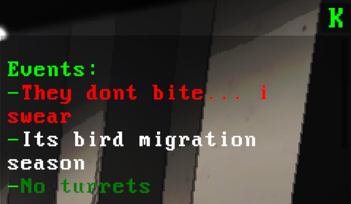

# Brutal Company Minus
#### This mod is required on all clients
#### Makes the game harder

# Features

  
<b>Event Mechanics<b/>

    
  - Whenever you land on a moon, a couple of events will be chosen, these events will appear in the UI in the top right hand corner of your screen, this can be open and closed by pressing 'k' or a custom set value in the config.

  - Events will come in 6 main types and are categorized by color
  - These types all have there own weights to get that type of event, this can be changed in the config to use custom set weights instead of type weights.

| Event Type                               | Default Weight Value |
|------------------------------------------|----------------------|
| ${\color{lime}{\textsf{Very Good}}}$     | 6                    |
| ${\color{green}{\textsf{Good}}}$         | 18                   |
| ${\color{green}{\textsf{Remove Enemy}}}$ | 15                   |
| ${\color{white}{\textsf{Neutral}}}$      | 15                   |
| ${\color{red}{\textsf{Bad}}}$            | 33                   |
| ${\color{maroon}{\textsf{Very Bad}}}$    | 13                   |
    

  
<b>Weather Multipliers</b>

